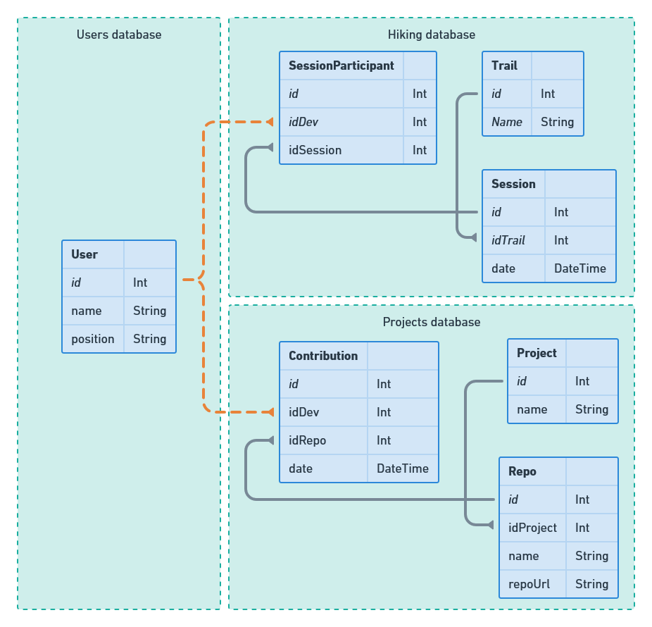

# nest-prisma-monorepo

[](https://github.dev/jpb06/nest-prisma-monorepo)

[](https://sonarcloud.io/summary/new_code?id=jpb06_nest-prisma-monorepo)
[](https://sonarcloud.io/summary/new_code?id=jpb06_nest-prisma-monorepo)
[](https://sonarcloud.io/summary/new_code?id=jpb06_nest-prisma-monorepo)
[](https://sonarcloud.io/summary/new_code?id=jpb06_nest-prisma-monorepo)
[](https://sonarcloud.io/summary/new_code?id=jpb06_nest-prisma-monorepo)
[](https://sonarcloud.io/summary/new_code?id=jpb06_nest-prisma-monorepo)
[](https://sonarcloud.io/summary/new_code?id=jpb06_nest-prisma-monorepo)
[](https://sonarcloud.io/summary/new_code?id=jpb06_nest-prisma-monorepo)
[](https://sonarcloud.io/summary/new_code?id=jpb06_nest-prisma-monorepo)
[](https://sonarcloud.io/summary/new_code?id=jpb06_nest-prisma-monorepo)


Here is the POC of a monorepo built with nestjs and prisma used to expose several apps, relying on several databases.

<!-- readme-package-icons start -->

<p align="left"><a href="https://docs.github.com/en/actions" target="_blank"></a>&nbsp;<a href="https://www.typescriptlang.org/docs/" target="_blank"></a>&nbsp;<a href="https://nodejs.org/en/docs/" target="_blank"></a>&nbsp;<a href="https://bun.sh/docs" target="_blank"></a>&nbsp;<a href="https://docs.docker.com" target="_blank"></a>&nbsp;<a href="https://www.postgresql.org/docs/" target="_blank"></a>&nbsp;<a href="https://biomejs.dev/guides/getting-started/" target="_blank"></a>&nbsp;<a href="https://github.com/motdotla/dotenv#readme" target="_blank"></a>&nbsp;<a href="https://expressjs.com/en/starter/installing.html" target="_blank"></a>&nbsp;<a href="https://jestjs.io/docs/getting-started" target="_blank"></a>&nbsp;<a href="https://docs.nestjs.com" target="_blank"></a>&nbsp;<a href="https://www.prisma.io/docs/" target="_blank"></a>&nbsp;<a href="https://rxjs.dev/guide/overview" target="_blank"></a>&nbsp;<a href="https://swagger.io" target="_blank"></a>&nbsp;<a href="https://swc.rs/docs/getting-started" target="_blank"></a>&nbsp;<a href="https://github.com/typestack" target="_blank"></a>&nbsp;<a href="https://webpack.js.org/concepts/" target="_blank"></a></p>

<!-- readme-package-icons end -->

## ⚡ Requirements

You will need the following to use this POC :

| Item                                                                                                           | Description                                             | Documentation                        |
| -------------------------------------------------------------------------------------------------------------- | ------------------------------------------------------- | ------------------------------------ |
|  nodejs | Duh!                                                    | <https://nodejs.org/en/>             |
|  Docker | we will use docker to launch a postgres instance        | <https://www.docker.com/get-started> |
|  bun          | We will use bun as the package manager for this project | <https://bun.sh/docs>                |

## ⚡ How to start

### 🔶 Firstof, let's start our database using docker

You may need to give execution permission to the entry point script file, that is responsible for creating our three databases:

```bash
chmod +x docker/pg-init-scripts/create-multiple-db.sh
```

Let's then use docker compose :

```bash
bun docker
```

### 🔶 Then we can migrate our schemas and seed the databases

```bash
bun dev:db
```

### 🔶 Launching our backends in dev mode

```bash
# Hiking app (port 5001)
bun dev hiking-app
# Projects app (port 5002)
bun dev projects-app
```

### 🔶 Accessing apps swaggers

Now we can access the swaggers of our apps using the following urls:

- [Hiking app](http://localhost:5001/api)
- [Projects app](http://localhost:5002/api)

### 🔶 Building our apps for production

```bash
bun run build
```

## ⚡ Project structure

### 🎉 Apps

| Database        | Description                                                                                                                                                  |
| --------------- | ------------------------------------------------------------------------------------------------------------------------------------------------------------ |
| 🚀 Hiking app   | This kiking app allows users to check and join hiking groups planning to do a walk on some trail. This app owns a database but also uses the Users database. |
| 🚀 Projects app | This projects app allows users to check contributions made to repositories. This app owns a database and also uses the Users database.                       |

### 🧩 Libs

| Database      | Description                                                                   |
| ------------- | ----------------------------------------------------------------------------- |
| 🧩 Boostraper | The code necessary to create an app is defined there and shared between apps. |
| 🧩 Databases  | The base prisma services are defined on this shared module.                   |
| 🧩 Decorators | Decorators used in all our apps.                                              |
| 🧩 Filters    | Filters used in all our apps.                                                 |
| 🧩 Pipes      | Pipes used in all our apps.                                                   |
| 🧩 Rxjs       | Rxjs helpers.                                                                 |
| 🧩 Tests      | Test related code.                                                            |

## ⚡ Data model

We have three databases:

| Database    | Description                                                                                                             |
| ----------- | ----------------------------------------------------------------------------------------------------------------------- |
| 👨 Users    | Contains our users (duh). This database will serve as the single base of truth for everything user related in our apps. |
| 🏔️ Hiking   | Database dedicated to the hiking backend service.                                                                       |
| 🧳 Projects | Database dedicated to the projects backend service.                                                                     |

Let's take a look at the schema:


